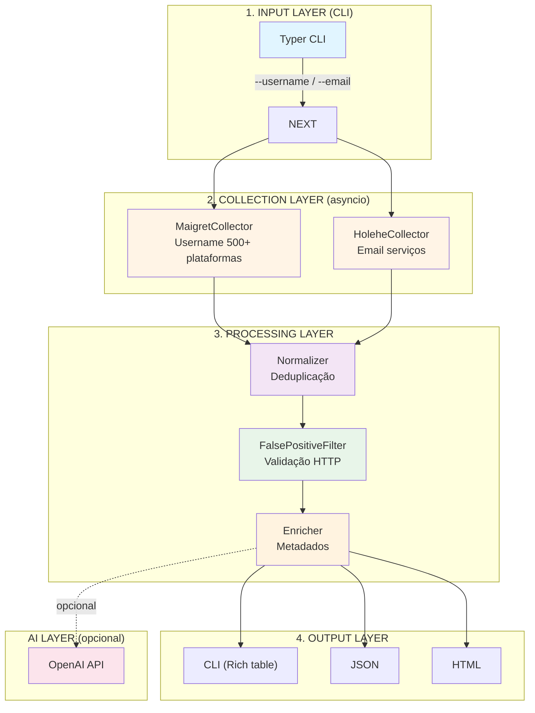
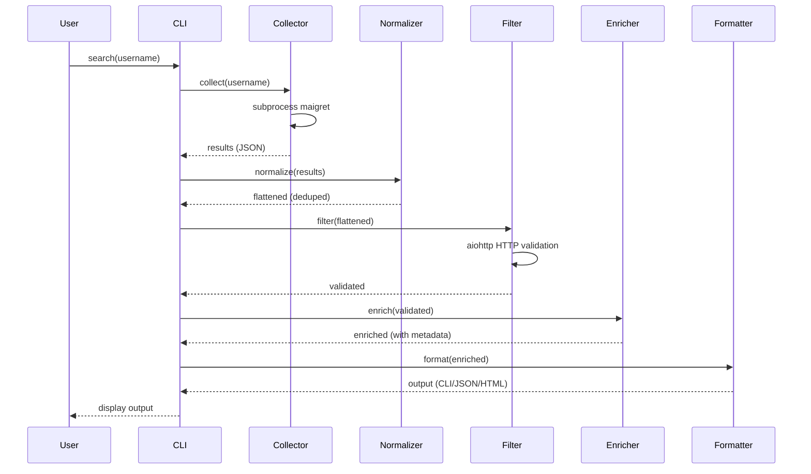

# ARGUS — Arquitetura do Sistema

> **Data:** 17/03/2026 | **Versão:** 1.0.0 | **Status:** Production Ready

---

## 1. Visão Geral de Alto Nível

ARGUS é uma suíte de OSINT CLI que implementa um **pipeline sequencial em 4 camadas** com separação clara de responsabilidades:



**Princípios arquiteturais:**
- ✅ **Modularidade**: Cada camada independente e testável
- ✅ **Tipagem**: `dataclasses` para DTOs, sem dicts arbitrários
- ✅ **Paralelismo**: `asyncio.gather()` para coletores simultâneos
- ✅ **Resiliência**: Timeout em subprocessos, graceful degradation
- ✅ **Extensibilidade**: Fácil adicionar coletores ou formaters

---

## 2. Interações de Componentes

### 2.1 Matriz de Dependências

| Componente | Entrada | Saída | Falha? |
|---|---|---|---|
| **MaigretCollector** | `username: str` | `List[AccountResult]` | Retorna erro, não crash |
| **HoleheCollector** | `email: str` | `List[AccountResult]` | Retorna erro, não crash |
| **Normalizer** | `List[List[AccountResult]]` | `List[AccountResult]` | Deduplica por chave |
| **FalsePositiveFilter** | `List[AccountResult]` | `List[AccountResult]` | Remove inválidos |
| **Enricher** | `List[AccountResult]` | `List[Dict]` | Add defaults |
| **ReportGenerator** | `username, results, type` | `AIReport` | `raise ValueError` |
| **ReportFormatter** | `username, results, ai` | `str (CLI/JSON/HTML)` | Formata |

### 2.2 Diagrama de Sequência



---

## 3. Fluxo de Dados Detalhado

### 3.1 Pipeline de Processamento

```python
# argus.py: fluxo principal simplificado

# 1. COLETA (paralela)
async def collect(username, email):
    tasks = []
    if username:
        tasks.append(MaigreCollector().collect(username))
    if email:
        tasks.append(HoleheCollector().collect(email))
    return await asyncio.gather(*tasks)

results = await collect(username, email)

# 2. NORMALIZAÇÃO
normalized = Normalizer.normalize(results)  # flatten + dedupe

# 3FILTRAGEM
filtered = await FalsePositiveFilter().filter(normalized)  # HTTP validate

# 4. ENRIQUECIMENTENTO
enriched = Enricher().enrich(filtered)  # add metadata

# 5. OUTPUT
formatter.to_cli(username, enriched, ai_report)
```

### 3.2 Estrutura de Dados

```python
# collectors/base.py
@dataclass
class AccountResult:
    site_name: str
    url: Optional[str]
    status: ResultStatus        # FOUND | NOT_FOUND | ERROR | TIMEOUT
    http_status: Optional[int]
    error: Optional[str]
    metadata: dict              # dados brutos do collector

# ai/models.py
@dataclass
class AIReport:
    summary: str
    profile_type: str
    insights: List[str]
    risk_flags: List[str]
    tags: List[str]
    digital_footprint_score: int
    confidence: str
    platforms_found: int
    high_value_platforms: List[str]
    categories: List[str]
```

---

## 4. Decisões de Design e Justificativa

### 4.1 Subprocessos para Coletores

**Decisão**: Executar `maigret` e `holehe` como subprocessos via `asyncio.create_subprocess_exec`.

**Justificativa**:
- Ferramentas maduras já existentes (+500 plataformas verificadas)
- Evita reimplementação complexa de detecção de cada site
- Isolamento: timeout em subprocesso não derruba CLI
- Python async permite paralelismo sem threads

**Trade-off**: Parsing de output não estruturado (Holehe) é frágil

### 4.2 Lazy Initialization do OpenAI Client

**Decisão**: `@property` com inicialização tardia em `ReportGenerator`.

**Justificativa**:
- CLI usada frequentemente sem `--ai`
- Economiza tempo de startup (~200ms de import OpenAI)
- Evita erro de API key desnecessário

```python
class ReportGenerator:
    def __init__(self):
        self._client = None

    @property
    def client(self):
        if self._client is None:
            from openai import OpenAI
            self._client = OpenAI(api_key=OPENAI_API_KEY)
        return self._client
```

### 4.3 Validação HTTP com aiohttp

**Decisão**: `TCPConnector(limit=20)` para validação paralela.

**Justificativa**:
- I/O bound se beneficia de concorrência
- Limite previne esgotamento de file descriptors
- `allow_redirects=True` captura redirecionamentos 404

### 4.4 Metadados Externalizados

**Decisão**: `config/platforms_metadata.json` para categorias.

**Justificativa**:
- Princípio Open/Closed: adicionar plataforma sem tocar código
- Tradução/facilidade de edição
- Pode ser versionado independentemente

**Limitação**: Mais de 500 plataformas = arquivo grande

### 4.5 Dataclasses em Vez de Dicts

**Decisão**: `AccountResult` e `AIReport` como `@dataclass`.

**Justificativa**:
- Type hints habilitam autocompletion do IDE
- `__dict__` disponível para serialização JSON
- Menos boilerplate que classes tradicionais
- mypy pode validar tipos

---

## 5. Restrições e Limitações

### 5.1 Dependências Externas

| Ferramenta | Versão | Limitação |
|-----------|--------|-----------|
| **maigret** | 0.5.0 | Sites com CAPTCHA retornam falso negativo |
| **holehe** | 1.61 | Output text-only, parsing via regex frágil |
| **openai** | 2.8+ | Requer API key paga, rate limits de 10-100 RPM |

### 5.2 Limitações do Sistema

| Área | Limitação | Impacto |
|------|-----------|---------|
| **Rate Limiting** | Plataformas bloqueiam após ~100 req/hora | Coletas podem ser incompletas |
| **Timeout** | 15s padrão por collector | Sites lentos retornam timeout |
| **Falsos Positivos** | Sites genéricos parecem "found" | Filtro HTTP mitiga mas não elimina |
| **PII** | Dados sensíveis em relatórios | Relatórios devem ser protegidos |
| **IA** | Max 128k tokens ≈ 50 plataformas | Truncamento para targets muito ativos |

### 5.3 Performance

| Operação | Tempo Típico | Gargalo |
|----------|-------------|---------|
| Coleta Maigret | 5-15s | Network latency |
| Coleta Holehe | 3-10s | DNS checks |
| Validação HTTP | 0.5-2s (paralelo) | aiohttp pool |
| Análise IA | 2-5s | OpenAI API |
| **Total** | **10-30s** | -- |

---

## 6. Estrutura de Arquivos

```
argus/
├── argus.py                 # CLI entry point (Typer)
├── pyproject.toml           # Dependências do projeto
├── pytest.ini               # Configuração de testes
├── requirements.txt         # Dependências para install.sh
├── install.sh               # Script de instalação
│
├── collectors/
│   ├── __init__.py
│   ├── base.py              # AccountResult, ResultStatus
│   ├── maigret.py           # MaigreCollector (username)
│   └── holehe.py            # HoleheCollector (email)
│
├── processing/
│   ├── __init__.py
│   ├── normalizer.py        # Normalizer.normalize()
│   ├── filter.py            # FalsePositiveFilter.filter()
│   └── enricher.py          # Enricher.enrich()
│
├── ai/
│   ├── __init__.py
│   ├── models.py            # AIReport dataclass
│   ├── report_generator.py  # ReportGenerator (OpenAI)
│   └── prompt_builder.py    # PromptBuilder.build()
│
├── output/
│   ├── __init__.py
│   └── formatter.py         # ReportFormatter (CLI/JSON/HTML)
│
├── config/
│   ├── __init__.py
│   ├── settings.py          # Configurações centralizadas
│   └── platforms_metadata.json  # Metadados de plataformas
│
├── tests/
│   ├── conftest.py          # Fixtures pytest
│   └── e2e/                 # Testes de ponta a ponta
│       ├── test_search_username.py
│       ├── test_search_email.py
│       ├── test_output_formats.py
│       ├── test_ai_analysis.py
│       └── test_error_cases.py
│
└── reports/                 # Output gerado (criado em runtime)
```

---

## 7. Extensibilidade

### 7.1 Adicionar Novo Coletor

```python
# collectors/new_tool.py
from .base import AccountResult, ResultStatus

class NewToolCollector:
    async def collect(self, target: str) -> List[AccountResult]:
        # Implementar coleta
        results = []
        # ...
        return results

# argus.py - adicionar no collect()
if username:
    tasks.append(NewToolCollector().collect(username))
```

### 7.2 Adicionar Novo Formato de Output

```python
# output/formatter.py
@staticmethod
def to_xml(username: str, results: List[Dict], ai_report: Optional[AIReport]) -> str:
    import xml.etree.ElementTree as ET
    root = ET.Element("report")
    # ... construir XML
    return ET.tostring(root, encoding="unicode")
```

---

## 8. Configuração

Variáveis de ambiente em `.env`:

```bash
# Obrigatório para IA
OPENAI_API_KEY=sk-...

# Diretório de output
ARGUS_OUTPUT_DIR=./reports

# Configurações de LLM
LLM_MODEL=gpt-4o-mini
LLM_TEMPERATURE=0.3

# Coletores
COLLECTOR_TIMEOUT=15
MAIGRET_TOP_SITES=20

# Validação HTTP
VALIDATE_URLS=true
VALIDATION_TIMEOUT=5

# Logging
ARGUS_LOG_LEVEL=INFO
```

---

## 9. Segurança e Privacidade

1. **PII**: Relatórios contêm informações pessoais sensíveis
2. **API Keys**: OpenAI key em `.env` (nunca commitar no git)
3. **Logs**: Usernames/emails são logados em DEBUG apenas
4. **Temp Files**: Maigret cria diretórios temporários em `/tmp` e limpa após
5. **HTTPS**: Todas as requisições usam HTTPS

---

## 10. Resumo Técnico

| Aspecto | Implementação |
|---|---|
| **Linguagem** | Python 3.10+ |
| **Async Runtime** | asyncio (subprocess + aiohttp) |
| **Tipagem** | dataclasses + type hints |
| **CLI Framework** | Typer + Rich |
| **IA API** | OpenAI (json_object mode) |
| **Performance** | ~10-30s end-to-end |
| **Testes** | 48 e2e tests (pytest) |
| **Instalação** | `pip install -e .` ou `./install.sh` |

---

**Documentação mantida por:** Gabriel Ramos | **Última atualização:** 17/03/2026
