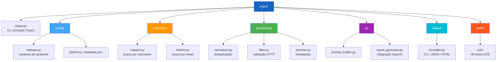
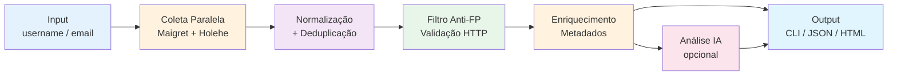

# ARGUS — OSINT Suite com IA

<p align="center">
  
</p>

OSINT Suite profissional com coleta paralela, validação HTTP e análise comportamental via IA.

## Funcionalidades

- Coleta paralela: Maigret (username) + Holehe (email)
- Filtro anti-falso-positivo com validação HTTP real
- Enriquecimento com metadados de plataformas
- Análise comportamental com GPT-4o-mini
- Output: CLI (tabela Rich), JSON, HTML

## Requisitos

- Python 3.10+
- OpenAI API Key (apenas para `--ai`)

## Instalação

```bash
git clone <seu-repo> argus
cd argus
bash install.sh
```

Ou manualmente:

```bash
pip install -e .
pip install maigret==0.3.7 holehe==1.0.1
cp .env.example .env
# edite .env com sua OpenAI API Key
```

## Configuração

Edite o arquivo `.env`:

```env
OPENAI_API_KEY=sk-...        # obrigatório para --ai
ARGUS_OUTPUT_DIR=./reports   # pasta de saída dos relatórios
VALIDATE_URLS=true           # validação HTTP anti-falso-positivo
COLLECTOR_TIMEOUT=15         # timeout dos coletores (segundos)
```

## Uso

```bash
# Busca por username (saída CLI)
argus search --username johndoe

# Busca por email
argus search --email john@example.com

# Busca combinada com análise de IA
argus search --username johndoe --email john@example.com --ai

# Salvar relatório JSON
argus search --username johndoe --format json

# Gerar e abrir relatório HTML
argus search --username johndoe --ai --format html --open

# Ver versão
argus version
```

## Estrutura do Projeto



## Testes

```bash
pytest tests/e2e/ -v
```

## Pipeline



---

Criado para investigação responsável de presença digital pública.
